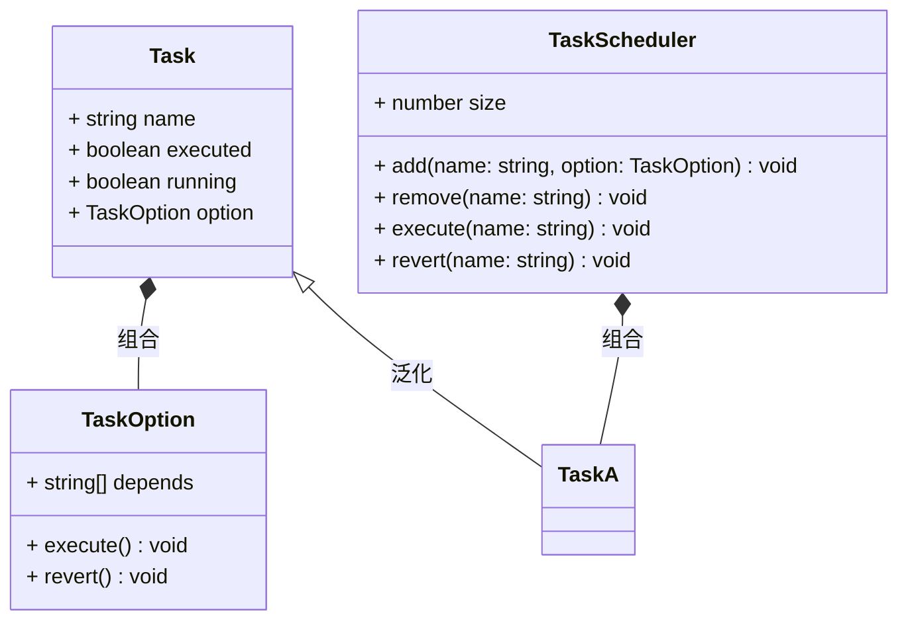
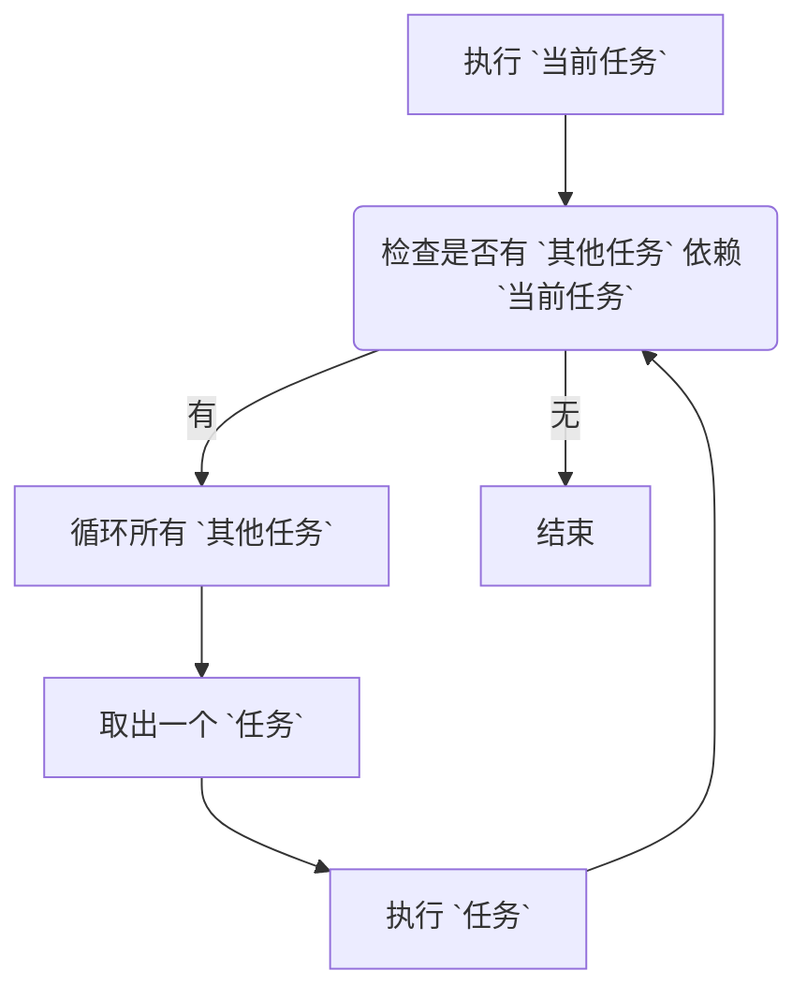

# Task Scheduler

[](https://www.npmjs.com/package/@itharbors/task-scheduler)
[](https://github.com/itharbors/task-scheduler/actions/workflows/ci.yaml)

### 目标与范围

管理任务，依赖任务自动触发。并提供任务还原功能，自动还原依赖的任务状态

## 需求分析

当多个实例初始化有依赖顺序的时候，往往需要很复杂的代码进行顺序的控制，特别是当其中某个实例可以重启、重新生成、被替换的时候。往往需要将依赖的后续实例全都更新一次，如果使用硬代码进行硬编程，会随着需求复杂而难以维护

### 功能需求

- 执行某个任务
- 回退某个任务
- 管理多个任务
- 管理任务间的依赖
- 当 `任务A` 完成后，自动触发依赖 `任务A` 的其他任务
- 当 `任务A` 状态回退后，自动回退依赖 `任务A` 的其他任务
- 任务不可多次执行
- 只有执行过的任务可以还原状态

### 非功能需求

- 暂无

## 整体结构

### 图例

基本结构



执行、回退任务流程



## 代码范例

基础用法

```typescript
import { TaskScheduler } from '@itharbors/task-scheduler';

const scheduler = new TaskScheduler();

// 注册任务
scheduler.add('a', {
    depends: [],
    execute() {
        console.log('execute a');
    },
    revert() {
        console.log('revert a');
    },
});
scheduler.add('b', {
    depends: [],
    execute() {
        console.log('execute a');
    },
    revert() {
        console.log('revert a');
    },
});

// 执行任务
scheduler.execute('a');

// 回退任务
scheduler.revert('a');
```

错误处理

```typescript
import { TaskScheduler } from '@itharbors/task-scheduler';

const scheduler = new TaskScheduler();

// 注册任务
scheduler.add('a', {
    depends: [],
    execute() {
        console.log('execute a');
    },
    revert() {
        console.log('revert a');
    },
});

// 执行任务
const results = scheduler.execute('a');
console.log(results.length);
console.log(results[0].name);
console.log(results[0].result);
console.log(results[0].error);

// 回退任务
// const reuslts = scheduler.revert('a');
```

## 关键决策

- 添加任务时，依赖任务已经执行完毕，不需要直接执行
    - 如果需要直接执行，那么添加一个不依赖任何任务的任务，需不需要直接执行？这时候就会出现处理差异

## 异常处理设计

- 任务执行失败
    - 描述
        - 任务执行 execute 里抛出了异常
    - 处理
        - 当成执行失败，还原成未执行状态
        - 中断后续任务的执行

- 任务回退失败
    - 描述
        - 任务执行 revert 里抛出了异常
    - 处理
        - 当成回滚失败，保持已经执行完毕的状态
        - 中断后续任务的执行

## 性能优化

- 暂无

## 附件与参考文档

- 暂无